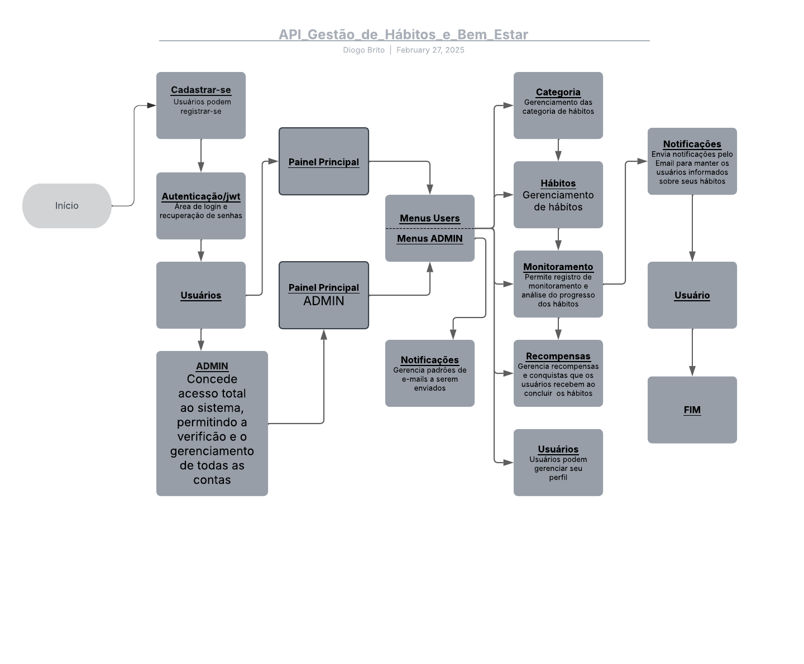

# API de Gestão de Hábitos e Bem-Estar

### Objetivo
- O objetivo da construção desta API foi praticar conhecimentos e adquirir experiência com a autenticação de usuários, a limitação de perfis e a tomada de decisões úteis em projetos construídos do zero.

## Descrição:
- Uma API para ajudar os usuários a criar, monitorar e manter hábitos saudáveis, com foco em bem-estar físico e mental.

### Funcionalidades:
- Cadastro de Hábitos: Criar hábitos diários/semanais/mensais (ex.: beber 2L de água, meditar, exercícios).
- Monitoramento de Progresso: Registro de conclusão diária, com gráficos para análise de progresso.
- Sistema de Recompensas: Conquistas por consistência (ex.: 7 dias consecutivos completados).
- Categorias de Hábitos: Saúde, Finanças, Estudo, etc.
- Notificações: Lembretes diários para completar os hábitos.
- Autenticação JWT: Perfis de usuários com sugestões personalizadas.

